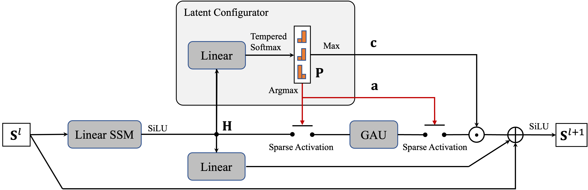

<h1 align="center">Sparse Modular Activation for Efficient Sequence Modeling</h1>
<div align="center">
  <span class="author-block">
    <a href="https://renll.github.io/">Liliang Ren</a><sup>1*</sup>,</span>
  <span class="author-block">
    <a href="https://nlp-yang.github.io/">Yang Liu</a><sup>2</sup>,</span>
  <span class="author-block">
    <a href="https://www.microsoft.com/en-us/research/people/shuowa/">Shuohang Wang</a><sup>2</sup>,
  </span>
  <span class="author-block">
    <a href="https://xycking.wixsite.com/yichongxu">Yichong Xu</a><sup>2</sup>,
  </span>
  <span class="author-block">
    <a href="https://www.microsoft.com/en-us/research/people/chezhu/">Chenguang Zhu</a><sup>2</sup>,
  </span>
    <span class="author-block">
    <a href="http://czhai.cs.illinois.edu/">ChengXiang Zhai</a><sup>1</sup>
  </span>
</div>
<div align="center">
  <span class="author-block"><sup>1</sup>University of Illinois at Urbana-Champaign,</span>
  <span class="author-block"><sup>2</sup>Microsoft Azure Cognitive Services Research,</span>
  <span class="author-block"><sup>*</sup> Work done at Microsoft internship and UIUC. </span>
</div>

[](https://arxiv.org/abs/2306.11197)  [](https://drive.google.com/file/d/1HrBSA5fnw8olx2pbNVJ8JVw3Hxh4fQKE/view?usp=sharing) 

## Introduction
This is the PyTorch implementation of SeqBoat :speedboat: proposed in our paper. This repository is based on [MEGA](https://github.com/facebookresearch/mega) and the [fairseq package v0.9.0](https://github.com/pytorch/fairseq/tree/v0.9.0).

<p align="center">
 
</p>

## Updates
- [Nov. 5] Released training scripts for enwik8 and added a standalone implementation of SeqBoat [here](standalone_seqboat.py)!
- [Sep. 21] Our paper is accepted by NeurIPS 2023!
- [July 18] Released training scripts for LRA and Speech Commands.

## Code Overview
1. The *compress* and *extract* operators for Sparse Modular Activation (SMA) are implemented in [fairseq/modules/seqboat_utils.py](fairseq/modules/seqboat_utils.py) with the functions `compress_seq` and `extract` respectively.
2. SeqBoat layer is implemented in [fairseq/modules/seqboat_unit.py](fairseq/modules/seqboat_unit.py).


## Setup
This repository requires Python 3.8+ and Pytorch 1.11+.

```bash
# Install from this repo
pip install -e .
```
For faster training, install NVIDIA's apex library following [fairseq](https://github.com/facebookresearch/fairseq#requirements-and-installation).

## Experiments

- [Long Range Arena](examples/seqboat/README.lra.md)
- [Speech Classification](examples/seqboat/README.sc.md)
- [Language Modeling](examples/seqboat/README.lm.md)

We also provide the training and testing scripts for each of the tasks in the `experiment` directory.

## Citation

If you find our work useful, please consider citing:

```bibtex
@inproceedings{ren2023sparse,
  title={Sparse Modular Activation for Efficient Sequence Modeling},
  author={Liliang Ren and Yang Liu and Shuohang Wang and Yichong Xu and Chenguang Zhu and ChengXiang Zhai},
  booktitle={Thirty-seventh Conference on Neural Information Processing Systems},
  year={2023},
  url={https://openreview.net/forum?id=TfbzX6I14i}
}
```

## License

SeqBoat is under MIT license. The license also applies to model checkpoints.

## Contact

Liliang Ren (liliang3@illinois.edu)
